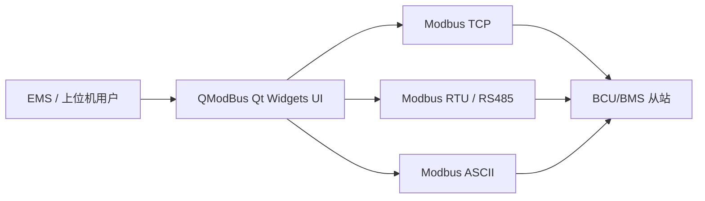
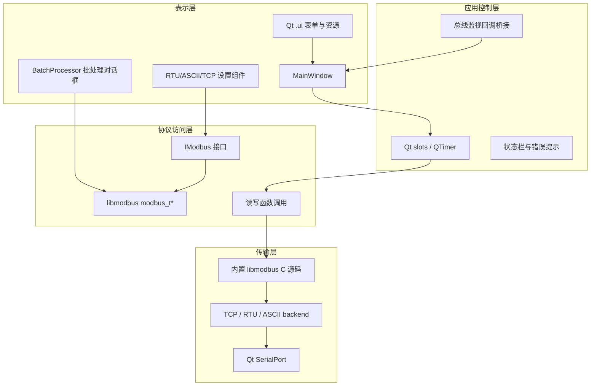
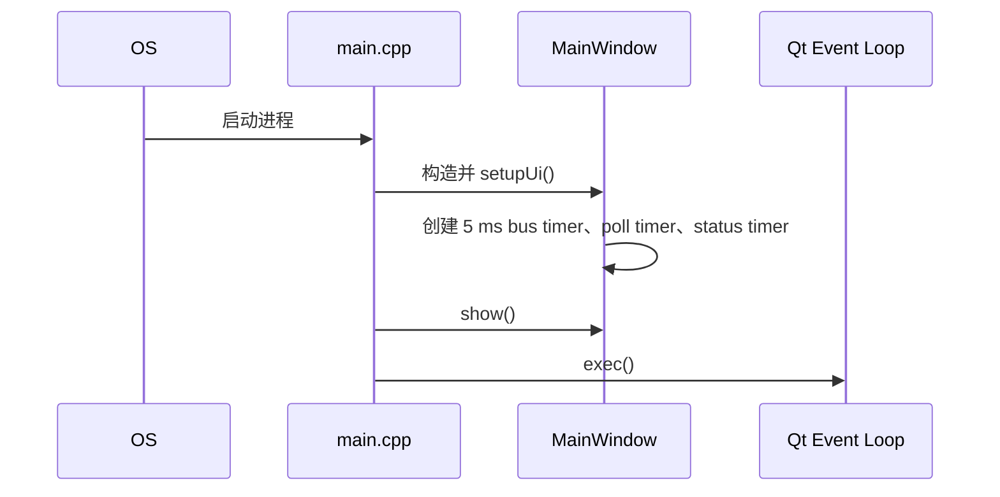
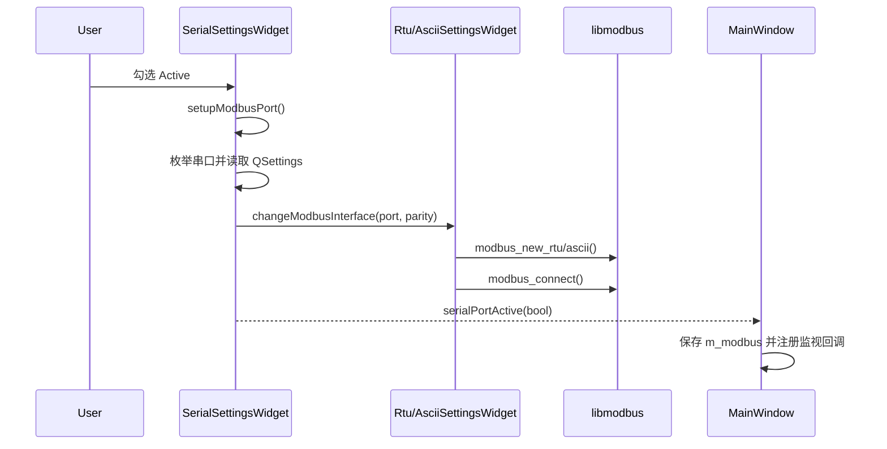
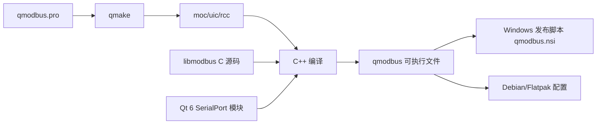
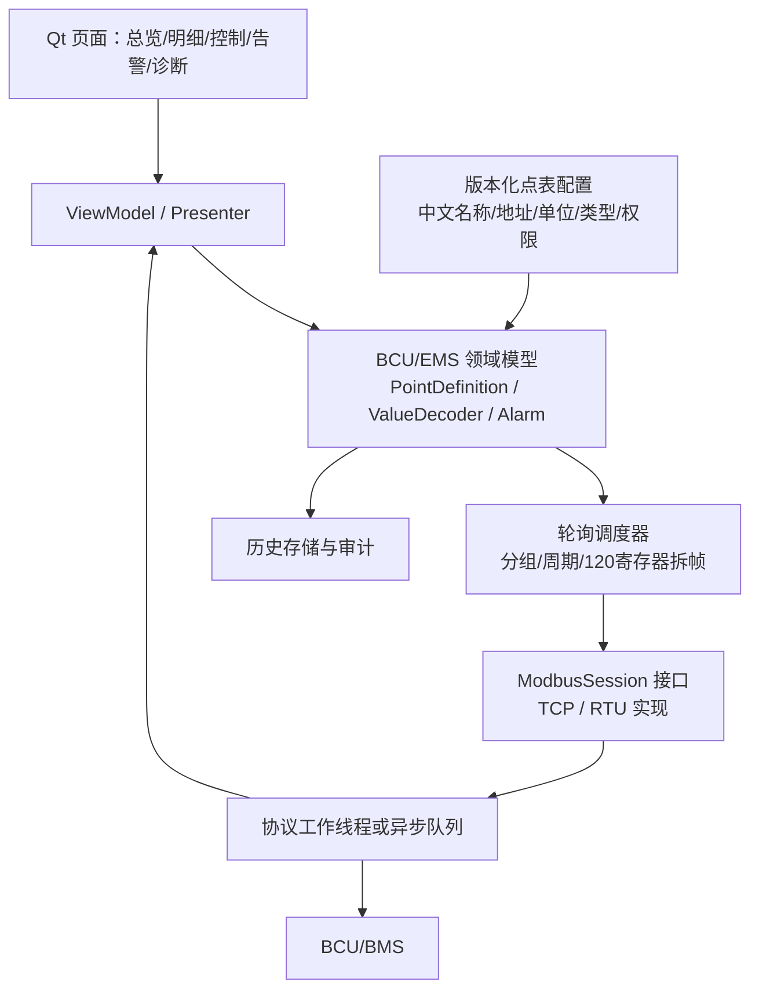

# QModBus 工程软件架构文档

## 1. 文档信息

| 项目 | 内容 |
| --- | --- |
| 分析对象 | `qmodbus-master` |
| 工程类型 | Qt 6 Widgets/C++ 桌面 Modbus 主站工具 |
| 构建系统 | qmake，工程文件 `qmodbus.pro` |
| 分析范围 | `src/`、`forms/`、`3rdparty/`、构建与发布配置 |
| 当前定位 | 通用 Modbus 调试、读写和总线监视工具，不是 BCU/EMS 专用上位机 |
| 分析结论 | 当前为 UI 驱动的单体架构；协议、调度、展示和错误处理集中在主窗口 |

> 本文记录代码中可验证的现状，并将面向 BCU/EMS 的改造建议单独列出。建议将本文与 [BCU-EMS Modbus 通信需求](./bcu_ems_modbus_requirements.md) 一起作为后续重构输入。

## 2. 系统上下文

当前程序向用户提供手动 Modbus 请求、寄存器结果查看、原始帧/总线监视和批量采集。现已加载 BCU/EMS 点表并具备中文名称、工程量解码和采集结果 SQLite 存储基础；业务页面、告警状态机和控制权限仍在后续步骤建设。

## 3. 架构分层（当前实现）

### 3.1 表示层

- `MainWindow`：主窗口、功能码选择、地址/数量输入、寄存器表、发送按钮、原始数据和总线监视表。
- `SerialSettingsWidget`：串口枚举、波特率、数据位、停止位、校验位和启停控件；`RtuSettingsWidget` 与 `AsciiSettingsWidget` 通过继承选择后端。
- `TcpIpSettingsWidget`：服务器地址、端口和启用控件。
- `BatchProcessor`：批量读取指定从站和地址，并周期输出 CSV。
- `forms/*.ui`：界面布局和控件定义；业务逻辑不在 UI 文件内。

### 3.2 应用控制层

`MainWindow` 是当前实际的应用服务边界，主要职责包括：

- 响应控件变化，生成请求预览和寄存器表。
- 在 `sendModbusRequest()` 中根据功能码直接调用 libmodbus。
- 通过 `QTimer` 实现手动轮询、5 ms 总线轮询和状态复位。
- 处理 `errno`、超时、I/O 错误和异常响应，并更新状态栏。
- 注册 libmodbus 的监视回调，将协议层数据写入 Qt 表格和文本框。

### 3.3 协议访问层

- `IModbus` 只有两个接口：返回 `modbus_t*` 的 `modbus()` 和设置端口的 `setupModbusPort()`。
- 实际协议调用直接使用 libmodbus C API：`modbus_read_registers()`、`modbus_read_input_registers()`、`modbus_write_register()`、`modbus_write_registers()` 等。
- `MainWindow` 和 `BatchProcessor` 都直接持有裸 `modbus_t*`，没有请求对象、结果对象、设备会话或统一错误类型。

### 3.4 传输层与第三方组件

| 组件 | 位置 | 作用 |
| --- | --- | --- |
| libmodbus | `3rdparty/libmodbus` | Modbus TCP、RTU、ASCII 上下文、帧处理、读写 API、监视回调 |
| Qt SerialPort | Qt 6 `SerialPort` 模块 | Windows/POSIX 串口枚举；Modbus RTU/ASCII 仍由 libmodbus 负责实际帧通信 |
| Qt 6 | 外部运行时 | Widgets、SerialPort、信号槽、定时器、文件、设置、资源系统 |

工程将 libmodbus 源码直接编译进应用；串口枚举使用 Qt SerialPort，不再编译 qextserialport。Windows 额外链接 `ws2_32`、`user32` 和 `advapi32`，并定义 `_TTY_WIN_`、`WINVER=0x0501`。

## 4. 模块与文件职责

| 模块 | 主要文件 | 责任 | 依赖方向 |
| --- | --- | --- | --- |
| 启动 | [`main.cpp`](./qmodbus-master/src/main.cpp) | 创建 `QApplication`、设置应用元数据、显示 `MainWindow` | Qt -> MainWindow |
| 主窗口 | [`mainwindow.h`](./qmodbus-master/src/mainwindow.h)、[`mainwindow.cpp`](./qmodbus-master/src/mainwindow.cpp) | UI 状态、请求构造、读写、轮询、监视、错误展示 | Qt + libmodbus + UI |
| 串口基类 | [`serialsettingswidget.h`](./qmodbus-master/src/serialsettingswidget.h)、[`serialsettingswidget.cpp`](./qmodbus-master/src/serialsettingswidget.cpp) | Qt SerialPort 枚举、参数读取、上下文创建触发和释放 | Qt SerialPort + libmodbus |
| RTU | [`rtusettingswidget.cpp`](./qmodbus-master/src/rtusettingswidget.cpp) | `modbus_new_rtu()` 和 RTU 连接 | 串口基类 + libmodbus |
| ASCII | [`asciisettingswidget.cpp`](./qmodbus-master/src/asciisettingswidget.cpp) | `modbus_new_ascii()` 和 ASCII 连接 | 串口基类 + libmodbus |
| TCP | [`tcpipsettingswidget.cpp`](./qmodbus-master/src/tcpipsettingswidget.cpp) | `modbus_new_tcp()` 和 TCP 连接 | Qt + libmodbus |
| 批处理 | [`BatchProcessor.cpp`](./qmodbus-master/src/BatchProcessor.cpp) | 定时单点读取、CSV 输出 | Qt + libmodbus |
| 采集存储 | [`acquisitionstore.h`](./qmodbus-master/src/acquisitionstore.h)、[`acquisitionstore.cpp`](./qmodbus-master/src/acquisitionstore.cpp) | 质量码、样本、通信事件、审计事件、SQLite/CSV | Qt Sql + PointTable + PollResult |
| 控件 | `ipaddressctrl.*`、`iplineedit.*` | IP 地址输入校验/分段编辑 | Qt |
| 界面 | `forms/*.ui` | 主窗体、设置页、批处理页布局 | Qt Designer |
| 构建 | [`qmodbus.pro`](./qmodbus-master/qmodbus.pro) | 源文件、头文件、UI、资源、平台条件 | qmake |

## 5. 关键运行时流程

### 5.1 启动流程

### 5.2 串口连接流程

### 5.3 手动读写流程

1. 用户在 `MainWindow` 选择功能码、从站 ID、起始地址和数量。
2. 控件信号触发 `updateRequestPreview()`、`updateRegisterView()` 和 `enableHexView()`。
3. 点击 Send 后进入 `sendModbusRequest()`。
4. 函数调用 `modbus_set_slave()`，按功能码分派到 libmodbus 读写 API。
5. 成功读取时将原始寄存器转换为十进制或十六进制文本并刷新 `regTable`，同时按点表中文名称、工程值和质量码写入 SQLite；写入时更新状态栏。
6. 失败时依据 `errno` 显示 I/O 或协议错误。

### 5.4 总线监视流程

- 三种连接激活处理函数向 `modbus_t` 注册 `stBusMonitorAddItem()` 和 `stBusMonitorRawData()`。
- 主窗口创建的 5 ms 定时器调用 `modbus_poll()`。
- libmodbus 通过全局 `globalMainWin` 回调回主窗口实例。
- 回调追加总线监视表行或原始十六进制文本。

### 5.5 批处理流程

- `openBatchProcessor()` 以模态方式创建 `BatchProcessor`，传入当前裸 `modbus_t*`。
- `start()` 打开并截断 CSV 文件，按秒启动 `QTimer`。
- `runBatch()` 解析形如 `slave:addr,addr;slave:addr` 的文本。
- 每个地址调用一次 `sendModbusRequest()`；当前批处理实现只真正支持 0x01-0x04 读取，写功能代码段被注释。

## 6. 数据与状态模型

当前没有独立的数据模型层，状态分散在以下位置：

| 状态 | 存储位置 | 特征 |
| --- | --- | --- |
| 当前协议上下文 | `MainWindow::m_modbus`、设置组件的 `m_*Modbus` | 裸指针，所有权不明确 |
| 当前传输模式 | `MainWindow::m_tcpActive` | 布尔标志，不能表达连接中/失败/重连等状态 |
| 请求参数 | UI 控件 | 没有请求对象或配置快照 |
| 返回寄存器 | `regTable` + `AcquisitionStore` | UI 展示字符串；SQLite 保留原始值、工程值、质量码、时间戳和耗时 |
| 连接配置 | `QSettings` | 目前主要保存串口参数；TCP 配置未持久化 |
| 采集历史 | SQLite `samples` 表 | 按设备、站号、点键、时间和质量码索引；支持固定版本 CSV 导出 |
| 通信事件 | SQLite `communication_events` 表 | 记录成功、失败和恢复事件，含功能码、地址、重试次数和耗时 |
| 控制审计 | SQLite `audit_events` 表 | 保存用户、点名、旧值、新值、结果和异常信息 |
| 监视数据 | `busMonTable`、`rawData` | UI 总线监视；通信事件已具备独立持久化入口 |

这意味着现有工程无法直接承载 BCU/EMS 点表中的中文名称、缩放单位、`u16/int16`、bit-field、R/RW 权限、数组寄存器、告警阈值和写后读回策略。

## 7. 构建与发布架构

- `QT += gui widgets serialport sql`，没有 Qt Network 模块，TCP 完全由 libmodbus 处理。
- `FORMS` 包含 5 个 UI 文件，`RESOURCES` 包含 `data/qmodbus.qrc`。
- 平台代码通过 `unix`/`win32` 条件编译；Windows 使用 Qt SerialPort 和 MSVC 系统库。
- `tests/pointmodel_test.pro`、`tests/pollscheduler_test.pro` 提供点表和轮询核心回归测试，点表生成工具位于 `tools/generate_point_table.py`。

## 8. 当前架构优点

- 依赖少、构建路径短，Qt Widgets 与 libmodbus 的组合适合快速搭建调试工具。
- TCP、RTU、ASCII 由同一套主窗口读写逻辑驱动，基础功能码覆盖较全。
- 内置总线监视回调，便于联调时观察请求、响应、CRC 和原始帧。
- 串口设置组件有一定复用：RTU 和 ASCII 共享串口枚举与控件。
- libmodbus 源码随工程交付，便于固定版本和离线构建。

## 9. 主要问题与风险

### 9.1 高风险：业务与协议强耦合

`MainWindow::sendModbusRequest()` 同时负责输入解析、功能码分派、libmodbus 调用、结果转换和 UI 更新。新增 BCU/EMS 点表后，地址、名称、缩放、权限和告警逻辑会继续堆积到主窗口，难以测试和复用。

### 9.2 高风险：TCP 连接生命周期不合理（步骤 1 已修复）

原实现中 `sendModbusRequest()` 在 `m_tcpActive` 时调用 `tcpConnect()`，每次请求都会释放并重新创建 TCP 上下文。步骤 1 已移除发送路径中的重复重连，TCP 控件启用时才建立连接，禁用和析构时主动释放上下文。后续仍需在 `ModbusSession` 抽离阶段补齐断线检测、重连退避和连接状态机。

### 9.3 高风险：资源所有权和释放不清晰（部分修复）

步骤 1 已让串口/TCP 设置组件在析构时释放活动上下文，并在 TCP 禁用时主动关闭连接；但 `MainWindow`、设置组件和批处理对话框仍共享裸 `modbus_t*`，连接切换和批处理期间的所有权边界仍不清楚，必须在步骤 2 用 RAII `ModbusSession` 消除。

### 9.4 高风险：回调依赖全局对象

`main.cpp` 暴露 `globalMainWin`，libmodbus 回调通过全局变量回到主窗口。这使协议层依赖具体 UI 实例，阻碍多会话、后台线程和单元测试，并增加退出阶段回调访问已销毁对象的风险。

### 9.5 中风险：错误状态表达不足

`m_modbus` 是否为空和 `m_tcpActive` 只能表示极少数状态，无法区分未配置、连接中、已连接、超时、设备异常、重连中和已禁用。串口连接失败时仍可能发出 active 信号，导致上层收到“激活”但上下文为空。

### 9.6 中风险：批处理功能与 UI 不一致

批处理 UI 展示了写入功能码，但 `BatchProcessor::sendModbusRequest()` 中的写入实现被注释，运行时只能读取。CSV 输出表达式把时间戳和从站 ID 直接串接，缺少明确分隔和表头，不适合作为稳定数据接口。

### 9.7 中风险：没有 BCU/EMS 点表领域模型

现有界面只展示通用“Data type / Register / Data”，没有中文名称、点位分组、寄存器数组、工程单位、缩放、bit 位、读写属性或写入权限。直接在此基础上扩展会造成协议地址和 UI 控件硬编码。

### 9.8 中风险：轮询与 UI 在同一线程

读写调用和 `modbus_poll()` 都在 Qt GUI 线程执行。设备超时或大量轮询时，窗口可能卡顿；5 ms 轮询定时器还会带来不必要的高频事件调度。当前没有请求队列、超时预算、重试策略或背压机制。

### 9.9 低风险：平台与依赖较旧

工程定义 `WINVER=0x0501`，目标兼容旧 Windows；qmake 工程直接内嵌较老的第三方代码。升级 Qt、编译器或 Windows 目标时，需要重新验证串口、网络和 ABI 行为。

## 10. 面向 BCU/EMS 上位机的目标架构建议

建议将现有工程演进为“领域配置驱动 + 后台协议会话 + Qt 展示”的分层架构：

### 10.1 建议的模块边界

| 新模块 | 责任 | 迁移来源 |
| --- | --- | --- |
| `transport` | TCP/RTU/ASCII 连接、重连、超时、上下文生命周期 | `*settingswidget.cpp` + libmodbus 调用 |
| `protocol` | 请求/响应对象、功能码、异常码、原始帧和统一错误 | `MainWindow::sendModbusRequest()` |
| `scheduler` | 轮询组、周期、拆帧、串行化请求、重试 | `QTimer` 逻辑 |
| `point_model` | 点定义、中文名称、英文键、地址、类型、单位、缩放、权限 | 当前缺失，输入来自通信点表 |
| `decoder` | u16/int16、bit-field、数组、时间戳和工程值转换 | 当前散落在 UI 展示 |
| `alarm` | 状态位解析、告警确认、恢复和事件记录 | 当前缺失 |
| `storage` | 原始值/工程值/质量码/时间戳、CSV/SQLite、审计 | `BatchProcessor` 的 CSV |
| `ui` | 页面和 ViewModel，不直接调用 libmodbus | `MainWindow`、各 `.ui` |
| `diagnostics` | 总线监视、通信统计、请求耗时和错误指标 | 当前回调桥接 |

### 10.2 针对现有 BCU/EMS 点表的落地规则

- 用版本化 JSON/YAML/CSV 配置承载 `名称`、`Name`、地址、单位、类型、属性、数量和 bit 定义。
- `名称` 只作为页面显示字段，`Name` 作为稳定程序键；不要把中文名称写死在 C++。
- 将 Rack Signal、Rack Measure、Rack Control、Rack Diag、Rack Detail、Alarm Parameters 建模为独立地址块和轮询组。
- 对 Rack Control 的 `0x0900-0x0901` 时间同步点建立显式例外映射，不能只按连续地址区间判断归属。
- 读取请求按最多 120 个寄存器拆分，并保存请求组与点位映射，避免跨保留区误合并。
- 对 `R/W` 点实施值域校验、权限控制、写后读回；对 reset/clear 类脉冲命令增加防重复发送。
- 协议线程只返回结构化结果，UI 线程负责展示；禁止协议回调直接操作控件。

## 11. 建议的重构顺序

1. **先修生命周期**：引入 RAII 会话对象，统一 TCP/RTU/ASCII 创建、连接、关闭和错误状态；去掉设置组件中的裸指针所有权歧义。
2. **抽离协议服务**：将 `sendModbusRequest()` 拆成 `ModbusSession` 和 `RequestExecutor`，保留现有 UI 作为临时调用方。
3. **引入点表模型**：加载通信点表配置，补齐中文名称、英文键、地址、单位、类型、读写属性和数量。
4. **引入后台调度**：把轮询和批处理移入 worker/队列，增加超时、重试、取消和统计。
5. **重做页面**：按 Rack/测量/控制/诊断/告警组织页面，使用点表模型驱动表格和控件。
6. **补齐测试**：先做协议请求构造、点值解码、地址分组、异常响应和写后读回测试，再做真实 BCU 联调。
7. **最后处理发布**：固定 Qt/compiler/libmodbus 版本，补充 Windows 安装包、配置迁移和日志/数据目录策略。

## 12. 验证清单

- [ ] TCP 长连接不会因每次轮询重复创建。
- [ ] 关闭串口/TCP 或退出程序后，所有协议上下文均释放。
- [ ] 协议线程与 GUI 线程之间只有线程安全的结构化消息。
- [ ] Rack Control 的 `0x0900/0x0901` 归属和写入顺序有自动化测试。
- [ ] 单帧寄存器数量超过 120 时能正确拆分并还原点位。
- [ ] 中文名称、英文键、单位和质量码在页面和历史记录中均可追溯。
- [ ] R 点不能写，R/W 点写入有权限、范围、确认和读回。
- [ ] 异常码、超时、断线、重连和设备地址错误均有可检索事件。
- [ ] 批处理 CSV 具备表头、固定字段、时间格式和错误行标识。
- [ ] 至少具备协议层、解码层和调度层的自动化测试。

## 13. 结论

`qmodbus-master` 适合作为 Modbus 调试工具的基础代码，但当前架构不是面向 BCU/EMS 生产上位机的架构。步骤 1 已修复 TCP 每次请求重连和部分析构释放问题；剩余主要技术债集中在协议调用和 UI 强耦合、裸指针会话共享、全局 UI 回调、缺少点表领域模型和后台调度。后续开发应优先建立独立的会话/调度/点表/解码边界，再逐步迁移现有界面和总线监视能力。
